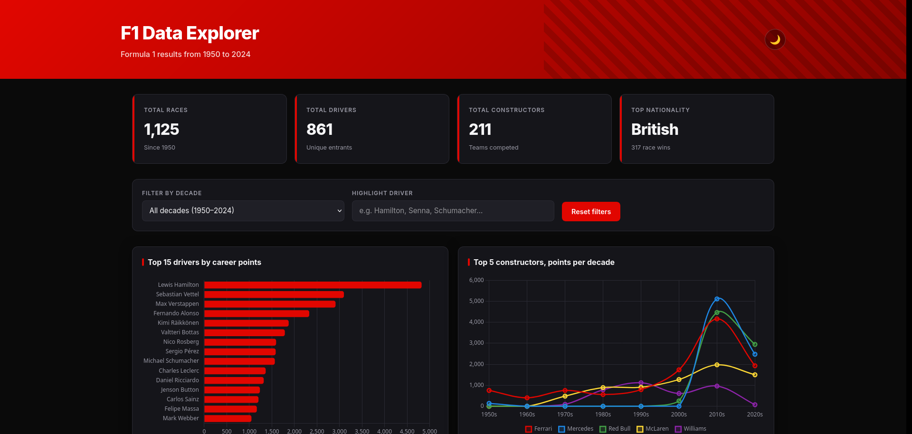

# F1 Data Explorer

A dashboard over Formula 1 results from 1950 to 2024. It is a single HTML file with no
backend. The browser parses four CSV tables, joins them and computes every chart and number.

Live version: [marin-orejas.github.io/f1-data-explorer](https://marin-orejas.github.io/f1-data-explorer/)

## What it shows

| Part | Content |
|---|---|
| Summary cards | Races, drivers and constructors, and the nationality with the most race wins |
| Top 15 drivers | The drivers with the most points |
| Top 5 constructors | Points per decade for the five constructors with the most points |
| Nationalities | The 10 nationalities with the most drivers |
| Grid and finish | Starting position against finishing position, for 500 random race entries |
| Grands Prix | The 10 Grands Prix held most often |
| Results table | 100 race results, sorted by points. Click a column to sort by it. |
| Findings | Four facts from the whole dataset, such as how often the driver starting on pole wins |

The decade filter applies to the cards, the charts and the table. Typing a driver's name
highlights that driver in the top 15 chart and in the table.

## Data

The data comes from the Ergast Motor Racing database, through the
[Formula 1 World Championship dataset on Kaggle](https://www.kaggle.com/datasets/rohanrao/formula-1-world-championship-1950-2020).
It covers the seasons from 1950 to 2024. The four tables are stored in `index.html` as CSV
text, so the page makes no data requests.

| Table | Rows | Used for |
|---|---|---|
| `races` | 1,125 | Year and Grand Prix name |
| `results` | 26,759 | Grid position, finishing position and points per driver per race |
| `drivers` | 861 | Name and nationality |
| `constructors` | 212 | Team name |

On load, PapaParse reads the four tables. The page builds a lookup by ID for races, drivers
and constructors, then joins each result to its race, driver and constructor. The filters
and charts work on this joined list.

## Built with

Plain JavaScript, HTML and CSS, with Chart.js 4.4 for the charts and PapaParse 5.4 for CSV
parsing. There is no build step.

## Run locally

Open `index.html` in a browser. Chart.js, PapaParse and the font load from a CDN, so the
page needs an internet connection.

## License

MIT, see [LICENSE](LICENSE).
